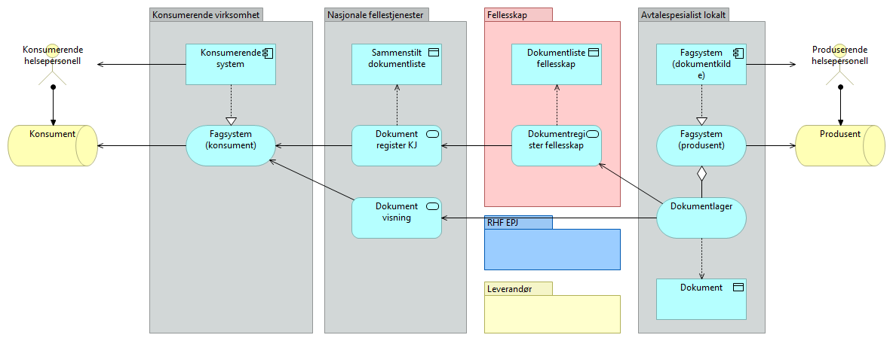
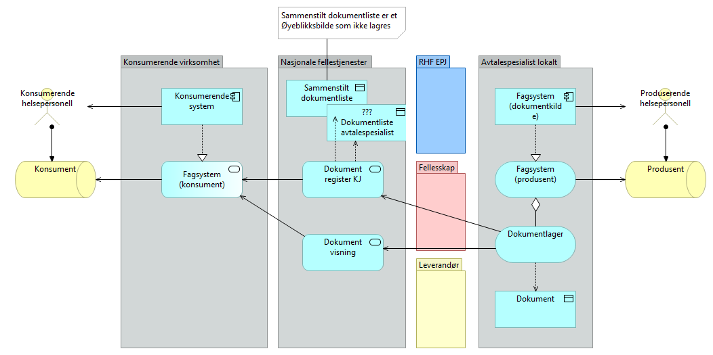

## Modeller for dokumentdeling

Samarbeidsområde for Helsedirektoratets arbeid med videreutvikling av referanse og målarkitektur for dokumentdeling.

### Modell for tjenestesammensetning konsument

### Modell for tjenestesammensetning produsent

  

### Konsept 1-5

Liten grad av variasjon.  

RHF1  
  

RHF2  
  

Fellesskap avtalespesialist  
  

Leverandør leverer registertjeneste  
  

Nasjonale tjenester  
  
