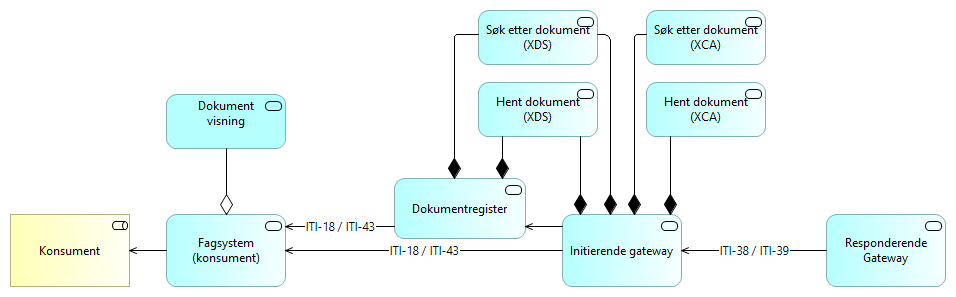
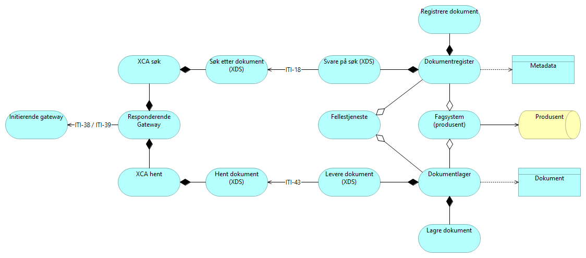

## Modeller for dokumentdeling

Samarbeidsområde for Helsedirektoratets arbeid med videreutvikling av referanse og målarkitektur for dokumentdeling.

### Modell for tjenestesammensetning konsument

### Modell for tjenestesammensetning produsent

  

### Konsept 1-5

En oversikt over konseptene kan vises i [pdf rapporten](https://github.com/Direktoratet-for-e-helse/dokumentdeling-archi/blob/gh-pages/Dokumentdeling.pdf), eller på den automatisk genererte [html siden](https://direktoratet-for-e-helse.github.io/dokumentdeling-archi/). 

## Test av automatisk bildeoppdatering
### Viewpoint
![Viewpoint] (https://github.com/Direktoratet-for-e-helse/dokumentdeling-archi/blob/gh-pages/id-ed54bc5ad0d34e9eaeec544f73517eb6/images/id-4d309b18daca42b2b7eb73d8cbc4a5a5.png)

### Modell for tjenestesammensetning konsument
![Viewpoint] (https://github.com/Direktoratet-for-e-helse/dokumentdeling-archi/blob/gh-pages/id-ed54bc5ad0d34e9eaeec544f73517eb6/images/id-ece74c10caf4485db58a4ed96f6f06f8.png)

### Modell for tjenestesammensetning produsent
![Viewpoint] (https://github.com/Direktoratet-for-e-helse/dokumentdeling-archi/blob/gh-pages/id-ed54bc5ad0d34e9eaeec544f73517eb6/images/id-cc7d317a9e1446fd85a30ddc9f1d3f89.png)